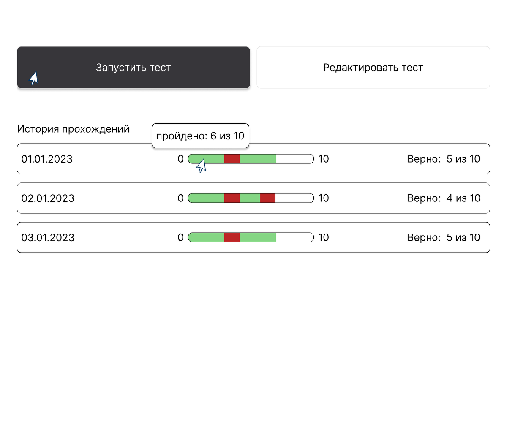
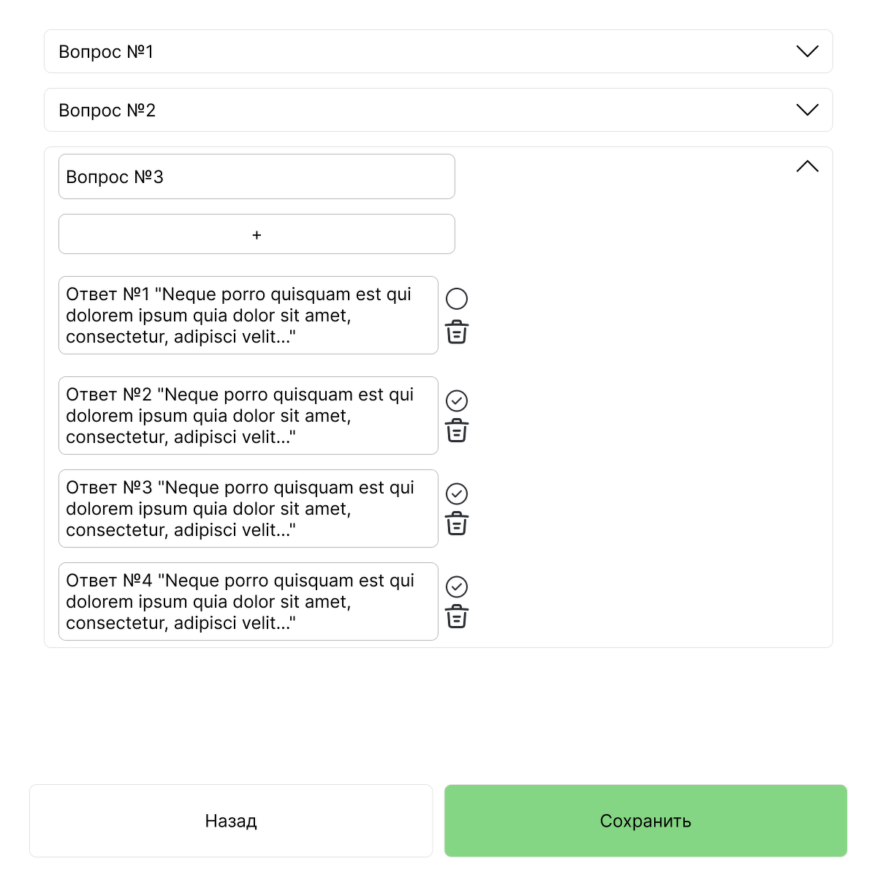

# Quiz Application v0.1


Веб-приложение для создания, редактирования и прохождения тестов с сохранением истории результатов.

## 🚀 Функциональные возможности

### 📋 Основные функции
- **Прохождение теста** с пошаговой навигацией по вопросам
- **Редактирование теста** с полным контролем над вопросами и ответами
- **История прохождений** с сохранением результатов в localStorage
- **Адаптивный дизайн** для всех устройств

### ✨ Особенности
- 📝 Неограниченное количество вопросов в тесте
- ✅ Несколько вариантов ответов с возможностью выбора одного правильного
- 🔄 Динамическое добавление/удаление вопросов и ответов
- 📊 Визуализация результатов с прогресс-баром
- 💾 Автосохранение истории в браузере
- 🎨 Современный интерфейс с плавными анимациями

## 📸 Скриншоты

### Главная страница


### Прохождение теста


### Редактирование теста


## 🛠 Технологический стек

### Frontend
- **React 18** - библиотека для построения пользовательского интерфейса
- **React Router** - навигация между страницами
- **CSS3** - стилизация с использованием Flexbox и Grid
- **Fetch API** - HTTP-запросы к серверу

### Backend
- **Node.js** - серверная платформа
- **Express.js** - веб-фреймворк
- **MongoDB** - база данных NoSQL
- **Mongoose** - ODM для MongoDB

## 📦 Установка и запуск

### Предварительные требования
- Node.js 16+
- MongoDB 5.0+
- npm или yarn

### Шаг 1: Клонирование репозитория
```bash
git clone https://github.com/ваш-логин/quiz-app.git
cd quiz-app
